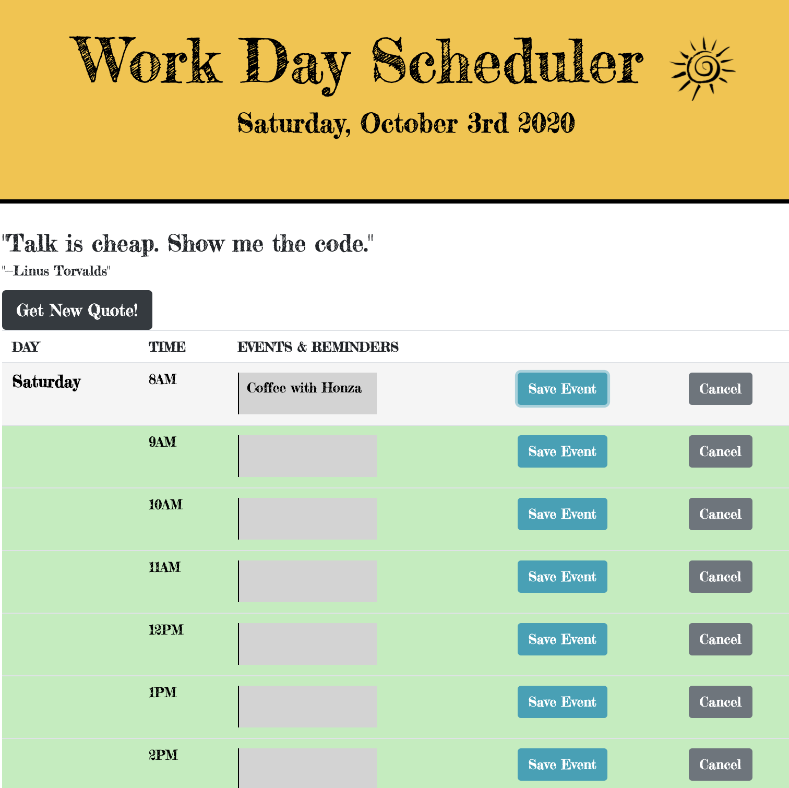

# schedule-planner

This simple schedule-planner displays a daily 8AM-5pm calendar and allows the user to plan appointments for each hour of the day. You can generate a new quote of the day from a famous author or public figure as a daily heading for inspiration.

The project utilizes html, css, jQuery, AJAX/JSON, Web APIs: Quotes, moment.js, and it dynamically updates the html/css via jQuery. 

The calendar displays the current time, there are timeblocks for standards business hours. Each timeblock is color coded to indicate whether it is in the past, present, or future. You can enter an event, meeting, or reminder in each table row and save it on the browser and to local storage. The event remains on the page when you refresh- and in local storage.  If you wish to cancel an event, you can click the cancel button and clear the event from the text area and from local storage.

Enjoy!

